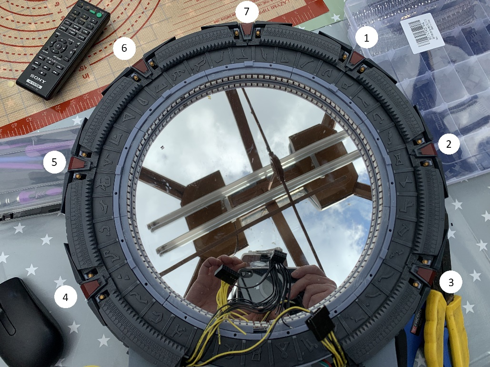
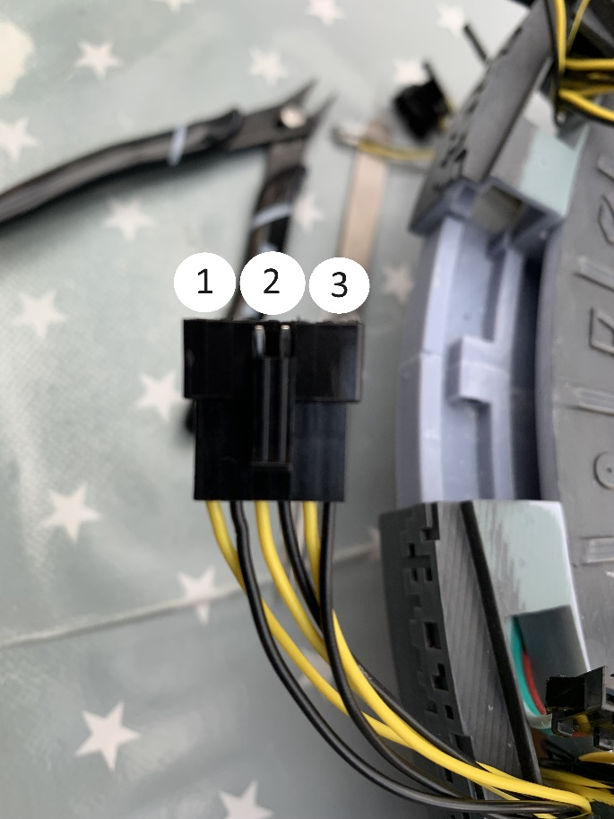
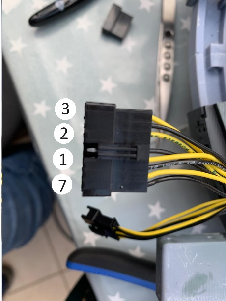
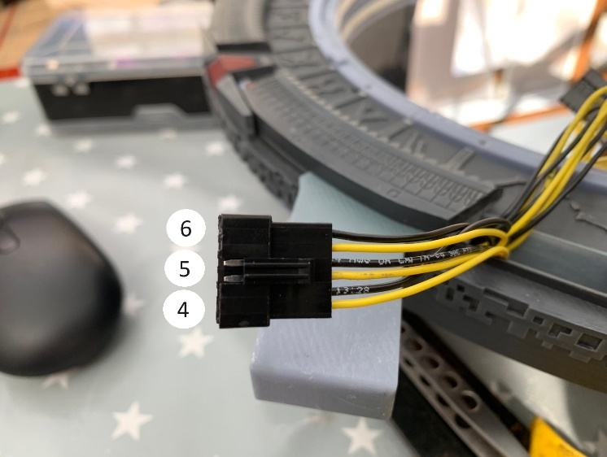
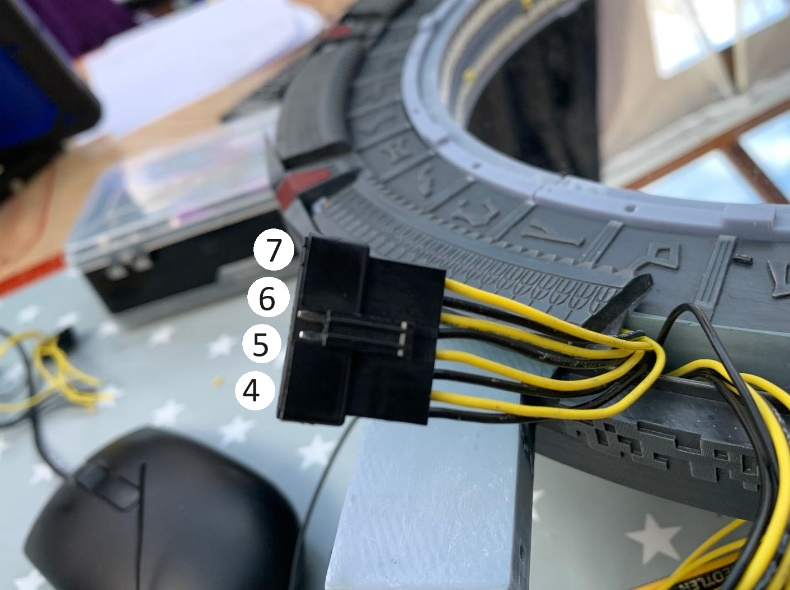

# Connectors

Main ring chevron and LED numbering

 
Right hand 6 way (LEDs)

Right hand 8 way (Motors)
Note, black and yellow should be reverse of the picture.

Left hand 6 way (Motors)

Left hand 8 way (LEDs)
Note, black and yellow are deliberately different from the other connectors.

PI Connector (6 way [2x3] + 16 way [2x8])

|     |          |      |     |
| --- | -------- | ---- | --- |
| 21  | NEO DATA |      | 22  |
| 19  |          |      | 20  |
| 17  |          |      | 18  |
|     |          |      |     |
| 15  |          |      | 16  |
| 13  |          |      | 14  |
| 11  |          |      | 12  |
| 9   | LED7     |      | 10  |
| 7   | LED6     |      | 8   |
| 5   | LED5     | LED3 | 6   |
| 3   | LED4     | LED2 | 4   |
| 1   | GND      | LED1 | 2   |

Main Motor Connector

| Motor 6 +VE     | ID3 : OP1 +VE | Stargate Motor : 6 |
| --------------- | ------------- | ------------------ |
| Motor 6 -VE     | ID3 : OP1 -VE |                    |
| Motor 5 +VE     | ID2 : OP1 +VE | Stargate Motor : 5 |
| Motor 5 -VE     | ID2 : OP1 -VE |                    |
| STEPPER – Red   | ID1 : OP1 +VE |                    |
| STEPPER – Blue  | ID1 : OP1 -VE |                    |
| STEPPER – Green | ID1 : OP2 +VE |                    |
| STEPPER – Black | ID1 : OP2 -VE |                    |
| Motor 4 +VE     | ID1 : OP3 +VE | Stargate Motor : 4 |
| Motor 4 -VE     | ID1 : OP3 -VE |                    |
| Motor 3 +VE     | ID2 : OP2 +VE | Stargate Motor : 3 |
| Motor 3 -VE     | ID2 : OP2 -VE |                    |
| Motor 2 +VE     | ID2 : OP3 +VE | Stargate Motor : 2 |
| Motor 2 -VE     | ID2 : OP3 -VE |                    |
| Motor 1 +VE     | ID2 : OP4 +VE | Stargate Motor : 1 |
| Motor 1 -VE     | ID2 : OP4 -VE |                    |
| Motor 7 +VE     | ID1 : OP4 -VE | Stargate Motor : 7 |
| Motor 7 -VE     | ID1 : OP4 -VE |                    |
 
Wiring Loom :
Motor lengths are measured with 40mm out of hole, 125mm past point X/Y

| Motor | Length (mm) | Routing |
| ----- | ----------- | ------- |
| 1     | 475         | RHS     |
| 2     | 350         | RHS     |
| 3     | 230         | RHS     |
| 4     | 320         | LHS     |
| 5     | 430         | LHS     |
| 6     | 550         | LHS     |
| 7     | 580         | RHS     |

Chevron lengths are measured to centre of chevron around circumference + 125mm past point X/Y

| Chevron LED | Length (mm) | Routing |
| ----------- | ----------- | ------- |
| 1           | 495         | RHS     |
| 2           | 365         | RHS     |
| 3           | 225         | RHS     |
| 4           | 225         | LHS     |
| 5           | 365         | LHS     |
| 6           | 495         | LHS     |
| 7           | 635         | LHS     |

---

From Discord

> #general-hammond  
> MrUnderhill — 04/09/2024 00:12  
> I used this handy document from @pablo70.
> 
> IMPORTANT - don't be like me. Remember that when you run wires for the chevron PCBs it will be mirrored lol

https://discord.com/channels/802180680922169375/802180682117808170/1280666855517716566